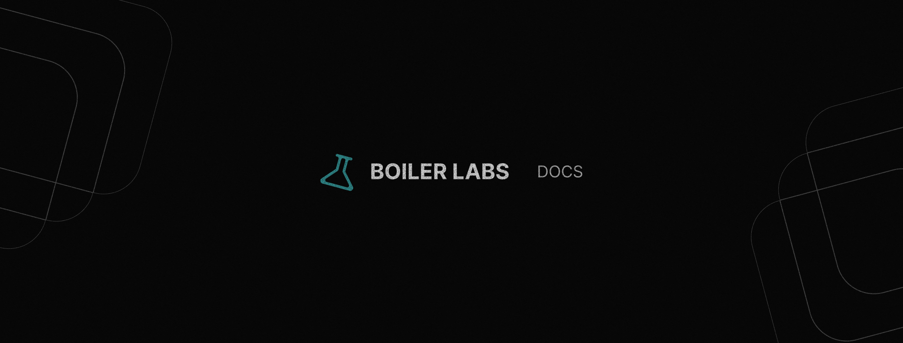

# BoilerLabs DOCS

A collection of clean and modular **documentation templates** designed to kickstart your open-source projects. These boilerplates cover everything from simple README files to more detailed documentation structures with examples, stats, and contributing guidelines.



## Table of Contents
1. [Features](#features)
2. [Getting Started](#getting-started)
3. [Usage](#usage)
4. [Contributing](#contributing)
5. [License](#license)

## Features
- Ready-to-use templates for README, contributing guidelines, and more.
- Modular design for easy customization.
- Templates include minimal and detailed versions with images, emojis, and stats.
- Perfect for any project: Node.js, Java, Spring, and more.

## Getting Started

1. Clone the repository:

```bash
git clone https://github.com/boilerlabs/docs
cd docs
```
   
2. Choose the template you need from the available directories (e.g., `README minimal`, `README detailed`, `CONTRIBUTING`, etc.).

3. Customize the templates to match your project’s needs.

## Usage

Simply copy the boilerplate files you need and modify them as per your project's details. For example, if you need a **minimal README**, copy the `README-minimal.md` file and edit the sections like title, description, and usage with your project-specific information.

```bash
cp templates/readme/minimal-1.md ./your-project/README.md
```

You can also customize the `CONTRIBUTING.md`, `CODE_OF_CONDUCT.md`, and other available templates to ensure a consistent and professional documentation structure across your projects.

## Contributing

We welcome contributions! If you want to improve or add new templates, feel free to open an issue or submit a pull request. Please see the [CONTRIBUTING.md](./CONTRIBUTING.md) for more details on how to get involved.

## License

This project is licensed under the MIT License - see the [LICENSE](./LICENSE) file for details.
