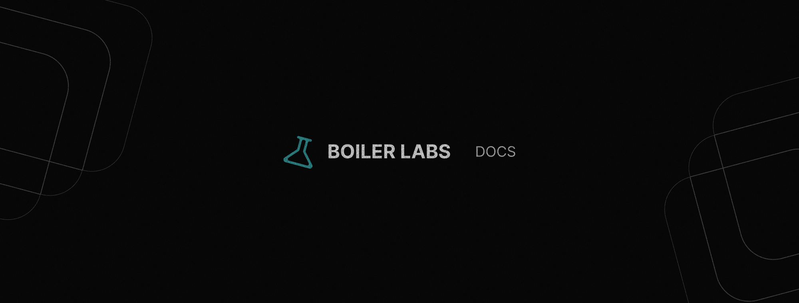

# 🎉 Project Title

A concise description of the project that highlights its purpose and utility.

  

---



## ✨ Features
- ✅ Feature 1: Brief explanation.
- ⚡ Feature 2: Key benefit or use.
- 🔧 Feature 3: Extra functionality.

## 🚀 Getting Started

### Prerequisites
- Node.js 16+
- npm or yarn

### Installation
1. Clone the repo:

```bash
git clone https://github.com/yourusername/yourproject
cd yourproject
```

2. Install dependencies:

```bash
npm install
```

3. Run the app:

```bash
npm start
```

## 🧑‍💻 Contributing
We welcome contributions! Please read the [CONTRIBUTING.md](./CONTRIBUTING.md) for guidelines on how to get started.

## 📄 License
This project is licensed under the MIT License - see the [LICENSE](./LICENSE) file for details.
